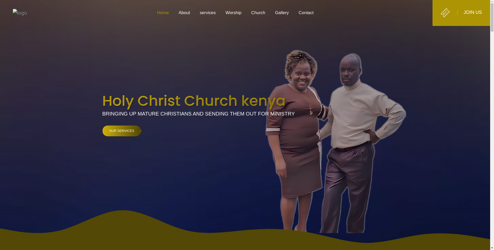
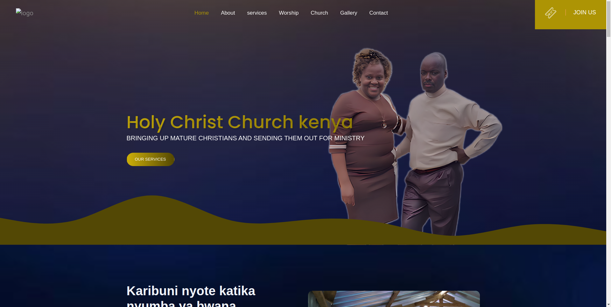
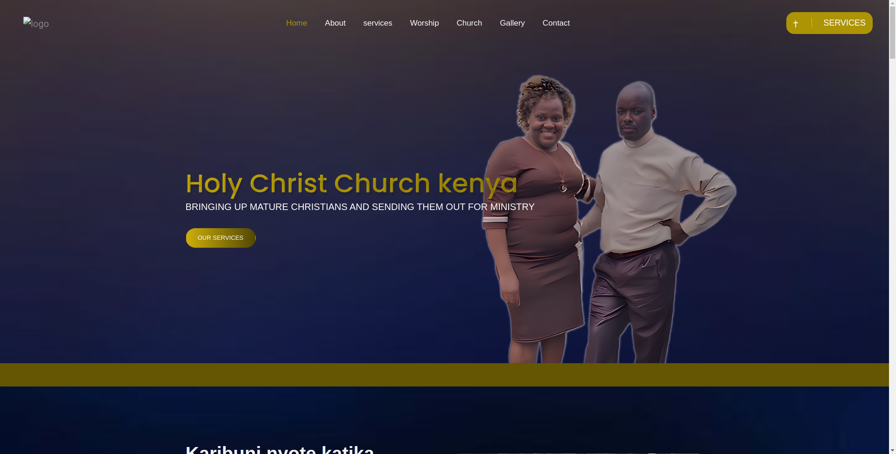

# Chuch website template by Mbelenzi


<!-- demo -->
## Example Site

| [](https://demo.themefisher.com/eventre/) | [](https://demo.themefisher.com/eventre/homepage-two.html) | [](https://demo.themefisher.com/eventre/about.html)  |
|:---:|:---:|:---:|:---:|
| **Home 1**  | **Home 2**  | **About**  |


👉🏻[View Live Preview](https://church999.vercel.app/)


#### Local setup

After successfully installing those dependencies, open this theme with any IDE [[VS Code](https://code.visualstudio.com/) recommended], and then open the internal terminal of IDM [vs code shortcut <code>ctrl/cmd+\`</code>]

* Install dependencies

```
npm install
```

* Run locally

```
npm run dev
```

After that, it will open up a preview of the template in your default browser, watch for changes to source files, and live reload the browser when changes are saved.

#### Production Build

After finishing all the customization, you can create a production build by running this command.

```
npm run build
```

Now you get a `theme` folder that has all the changes you have made. you can use this folder as your main theme.


<!-- support -->
## Technical Support or Questions (Paid)

If you have questions or need help integrating the product please [contact us](mbelenzialexander1@gmail.com) instead of opening an issue.
<!-- reporting issue -->

 have questions or need help integrating the product please [contact us](mbelenzialexander1@gmail.com) instead of opening an issue. mbelenzialexander1@gmail.com

<!-- licence -->
## License

Copyright (c) 2024 - Present, Designed & Developed by [Coddextech](https://coddextech.com)

**Code License:** Released under the [MIT](https://github.com/coddextech/coddex/blob/main/LICENSE) license.


<!-- resources -->
## Resources

Some third-party plugins that we used to build this template. Please check their license.

* **Bootstrap v4.5.3**: <https://getbootstrap.com/docs/4.5/getting-started/introduction/>
* **Jquery**: <https://jquery.com/download/>
* **Google Fonts**: <http://fonts.google.com/>
* **Slick**: <https://kenwheeler.github.io/slick/>
* **Shuffle**: <https://vestride.github.io/Shuffle/>
* **SyoTimer**: <http://syomochkin.xyz/folio/syotimer/demo.html>
* **Magnific Popup**: <https://dimsemenov.com/plugins/magnific-popup/>
* **Font Awesome Free**: <https://fontawesome.com/>
